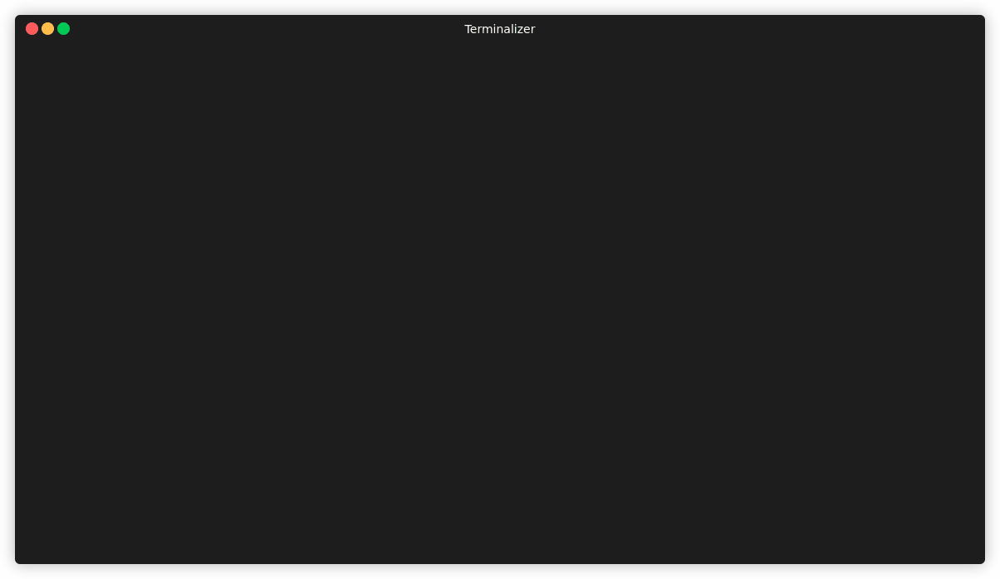

<br/>

<div align="center">
  <br />
  
  <h1>Swarm Management at the Speed of Thought</h1>

  <p>
    <strong>The terminal-UI for Docker Swarm you’ve been waiting for. Fast, keyboard-driven, and open source.</strong>
  </p>

  <p>
    <a href="https://github.com/Eldara-Tech/swarmcli/actions"></a>
    <a href="https://goreportcard.com/report/github.com/Eldara-Tech/swarmcli"></a>
    <a href="https://github.com/Eldara-Tech/swarmcli/releases"></a>
    <a href="https://github.com/Eldara-Tech/swarmcli/blob/main/LICENSE"></a>
  </p>

  <p>
    <a href="#why-swarmcli">Why SwarmCLI?</a> •
    <a href="#quickstart">Quickstart</a> •
    <a href="#features">Features</a> •
    <a href="#installation">Installation</a> •
    <a href="CONTRIBUTING.md">Contributing</a> •
    <a href="https://swarmcli.io/">Homepage</a>
  </p>
</div>

---

## Visual Feast



## Why SwarmCLI?

In the Kubernetes world, **k9s** is the gold standard for cluster management. We believe Docker Swarm users deserve the same level of quality, speed, and intuition.

**"Because Swarm is not dead, it's just efficient. And it deserves better tools."**

SwarmCLI translates the complexity of Docker Swarm into a sleek, keyboard-centric terminal UI. It’s built for developers who want to manage their clusters without leaving the terminal or waiting for heavy Web UIs to load.

## Quickstart

Get up and running in seconds:

```bash
# macOS/Linux via Homebrew
brew tap eldara-tech/tap
brew install swarmcli

# Run it
swarmcli
```

## Features

- **Real-time Observability**: Live monitoring of Services, Tasks, Nodes, and Containers.
- **Stack Awareness**: Navigate your cluster hierarchically (Stacks > Services > Tasks).
- **Instant Logs**: No more `docker service logs -f`. Just press `l` on any service.
- **Secrets & Configs**: Manage, rotate, and — with [Business Edition](#business-edition) — **reveal** secrets for debugging.
- **Management Actions**: Scale, restart, remove, and update services with single keystrokes.
- **Chart Package Manager**: Helm-like packaging for Swarm — install, upgrade, roll back, and diff releases from chart repositories via `swarmcli charts`.
- **Zero Config**: Works out-of-the-box with your local Docker engine or remote via SSH/Contexts.
- **Lightweight**: Built with Go. Single static binary (< 20MB). Zero dependencies.

## Charts (CLI)

A bare `swarmcli` launches the TUI, but a few commands run non-interactively
when arguments are supplied: `swarmcli version`, `swarmcli help`, and the
Helm-like chart package manager `swarmcli charts <command>`:

```bash
# Repositories
swarmcli charts repo add <name> <url>     # add a repo and download its index
swarmcli charts repo list                 # list configured repos
swarmcli charts repo update [name]        # refresh indexes (all, or one)
swarmcli charts repo remove <name>        # remove a repo

# Discovery
swarmcli charts search [keyword]          # search charts across repos
swarmcli charts show chart  <repo/chart>  # chart metadata (also: values, schema)

# Releases
swarmcli charts template <release> <repo/chart>   # render manifest (no deploy)
swarmcli charts install  <release> <repo/chart>   # install a chart as a release
swarmcli charts upgrade  <release> <repo/chart>   # upgrade to a new revision
swarmcli charts diff upgrade <release> <repo/chart>  # preview upgrade changes
swarmcli charts rollback <release> <revision>     # re-deploy a past revision
swarmcli charts uninstall <release>               # remove a release
swarmcli charts history <release>                 # revision history
swarmcli charts list                              # list releases
swarmcli charts status <release>                  # release status and services
```

Run `swarmcli charts --help` for the full command and option reference.

## Business Edition

The Community Edition is the full open-source TUI. **Business Edition** is a
commercial superset that adds:

- `:bootstrap` — one-command deploy of an mTLS-fronted RBAC proxy and
  per-node agent stack onto your existing Swarm.
- Per-user RBAC, identity by client certificate, role-gated mutation and
  exec.
- Interactive shell into a running service task.
- Reveal-secret for debugging.

Installs via `brew install Eldara-Tech/tap/swarmcli-be`,
`scoop install swarmcli-be`, or `docker pull eldaratech/swarmcli-be`. The
binary on disk is named `swarmcli` (BE is a strict superset of CE — same
binary name, expanded feature set), so existing scripts and aliases
continue to work.

Documentation, install channels, and license sign-up are at the BE release
repo: [Eldara-Tech/swarmcli-be-releases](https://github.com/Eldara-Tech/swarmcli-be-releases).

## Installation

<!-- ### Docker (No Installation)

```bash
docker run --rm -it \
  -v /var/run/docker.sock:/var/run/docker.sock \
  ghcr.io/eldara-tech/swarmcli:latest
``` -->

### Build from Source

```bash
git clone https://github.com/Eldara-Tech/swarmcli.git
cd swarmcli
go install
```

## Using Docker container to build and run locally

```
docker build -t swarmcli-dev .
docker run --rm -it -v "$PWD":/app -v /var/run/docker.sock:/var/run/docker.sock  -w /app swarmcli-dev
```

or with docker compose:

```
docker compose run --build --rm swarmcli
```

Then run:

```
go run .
```

## Logging

```bash
# Production (default)
$ go run .
# → writes JSON logs to  ~/.local/state/swarmcli/app.log

# Development
$ SWARMCLI_ENV=dev go run .
# → writes pretty logs to ~/.local/state/swarmcli/app-debug.log

# Optional: control verbosity
$ LOG_LEVEL=debug SWARMCLI_ENV=dev go run .
```

### Environment variables

- `SWARMCLI_ENV`: `dev` enables pretty debug logs (default is `prod`).
- `LOG_LEVEL`: `debug`, `info`, `warn`, `error`, …
- `SWARMCLI_DISABLE_VERSION_CHECK=true`: disables the startup request to `https://swarmcli.io/api/v1/version` that checks whether a newer release is available.

On startup, SwarmCLI checks for a newer release by sending the current version and edition to `https://swarmcli.io/api/v1/version`. Set `SWARMCLI_DISABLE_VERSION_CHECK=true` to opt out.

Colorize log tails. Not perfect but simple:

```bash
sudo apt install ccze
tail -f ~/.local/state/swarmcli/app-debug.log | ccze -A
```

### Integration tests

The logs for the integration tests can be enabled with:

```bash
TEST_LOG=1 ./test-setup/testenv.sh test
```

## Key Bindings

| Key      | Action                  |
| :------- | :---------------------- |
| `?`      | Show Help / Cheat Sheet |
| `:stack` | Navigate to Stacks      |
| `:svc`   | Navigate to Services    |
| `:node`  | Navigate to Nodes       |
| `:config`  | Navigate to Config    |
| `:secret`  | Navigate to Secret    |
| `:network` | Navigate to Networks  |
| `:volume`  | Navigate to Volumes   |
| `l`      | View Logs               |
| `s`      | Scale Service           |
| `r`      | Restart Service         |
| `ctrl-c` | Quit                    |

## Project Hygiene

Impeccable project hygiene is the backbone of a thriving ecosystem.

- **[Contributing](CONTRIBUTING.md)**: We ❤️ contributions! Check our guide to get started.
- **[Security](SECURITY.md)**: Found a bug? Let us know securely.
- **[Code of Conduct](CODE_OF_CONDUCT.md)**: Expectations for our community.
- **[License](LICENSE)**: Apache 2.0.

## Releasing

Releases are fully automated — **no manual version file to update**. The git tag is the single source of truth.

```bash
git tag v1.5.0
git push origin v1.5.0
```

Pushing a `v*` tag triggers the [release workflow](.github/workflows/release.yml) which:

1. Injects the tag into the binary via GoReleaser ldflags (`-X main.version=1.5.0`)
2. Builds for Linux, macOS, Windows, and FreeBSD (multiple architectures)
3. Publishes a GitHub release with auto-generated changelog
4. Pushes multi-arch Docker images to Docker Hub
5. Updates the [Homebrew tap](https://github.com/Eldara-Tech/homebrew-tap) and [Scoop bucket](https://github.com/Eldara-Tech/scoop-bucket)

The in-app `Version:` header reads from the injected value. Local builds without GoReleaser show `dev`.

---

<div align="center">
  <sub>Built by the community for the community. Made with ❤️ for the Docker Swarm community.</sub>
</div>
