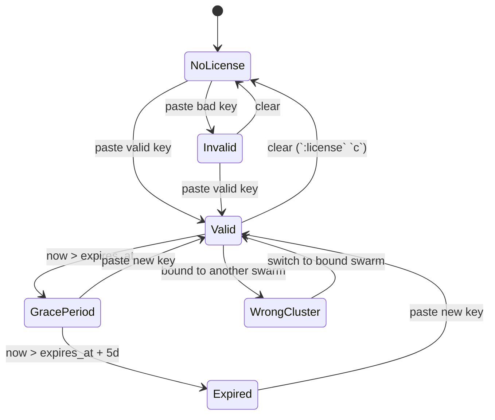
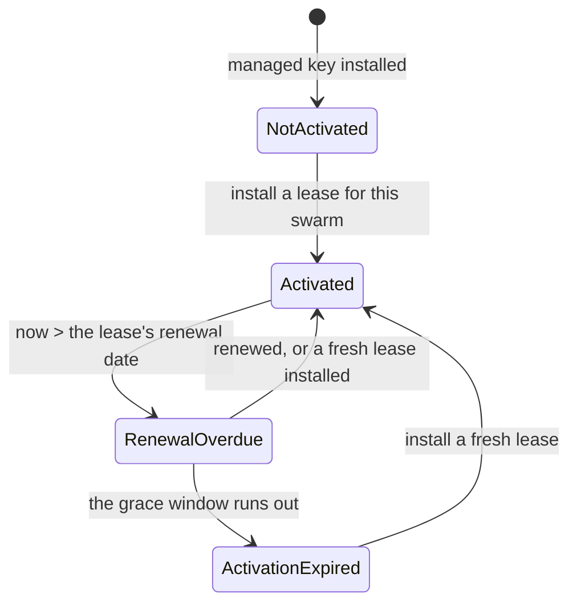

<!--
SPDX-License-Identifier: Apache-2.0
Copyright © 2026 Eldara Tech
-->

# License

SwarmCLI Business Edition runs against a signed license key. This page
covers the model, the activation paths, and the lifecycle states a key
goes through.

## Model

A license key is a single opaque string, cryptographically signed by Eldara
Tech and verified by the `swarmcli` binary offline. Verification never involves
us: swarmcli checks the signature itself, so a key works on an air-gapped
swarm and no outage of ours can disable your features. Keys are versioned, so
a key issued today keeps working when the format gains a field.

Any license may use the network to collect a key we re-signed for it, and a
[managed license](#managed-licenses-activation-is-a-second-step) adds a renewal
step on top — never verification, and there is an offline path for both.
[Privacy](#privacy) says exactly what is sent and when.

What a key records about you:

- **Who it is for** — your customer identifier.
- **Which tier** — `be` (Business Edition) or `trial`. Both grant the same
  feature set today, so the expiry is what separates them — a `trial` must
  carry one, and from v2.0.0 a key that does not is refused.
- **When it expires**, if ever. A `be` key may be issued without an expiry; a
  `trial` may not.
- **Node and user limits**, if any. See [Limits](#limits).
- **Which swarm it is bound to**, if any, and **how** — see
  [Per-swarm binding](#per-swarm-binding).
- **A license id** — a short `lic_…` string naming this individual license.
  See [License id](#license-id).

What a key does *not* record is a list of features. Entitlements are derived
from the tier, so adding a capability to a tier benefits every outstanding key
for that tier without re-issuing — and no key can claim a feature its tier does
not grant.

## Acquiring a key

Get a key (including a free trial) at [swarmcli.io/be](https://swarmcli.io/be).

## Activation

The active key is the one stored on the connected swarm, as a Docker
Config named `swarmcli-license` (see
[Per-swarm storage](#per-swarm-storage)). That is the only place swarmcli
loads a key from, so that every component agrees on which license is in
force no matter which machine the TUI runs on.

Two *portable* sources let you carry a key to a swarm without re-issuing
it: the `SWARMCLI_LICENSE` environment variable and the file
`~/.config/swarmcli/license.key`. Neither is activated on its own. When
one is present the `:license` view lists it with the keystroke that
installs it into the connected swarm, and the source is preserved
afterwards so you can install the same key on further swarms.

So there are three ways to activate a key, all of which end with it
stored on the swarm:

1. Paste it into the license prompt (see below) or into `:license` `s`.
2. `:license install <path-to-license.key>` from the command bar — see
   [`:license` subcommands](#license-subcommands).
3. Press the listed key on the `:license` view to install from
   `$SWARMCLI_LICENSE` or from `~/.config/swarmcli/license.key`.

### Managed licenses: activation is a second step

A **managed** license names its swarm in the key, exactly as a key bound at
issuance does, and is then *activated* for that swarm. Installing the key is
the first step; the second is an **activation lease** — a short-lived signed
artifact naming that license and that swarm.

On a swarm that can reach us, the second step takes care of itself. A managed
license with no lease installed is due for renewal by definition, and the
check runs every few minutes and again whenever you open `:license` — so
activation follows the key install on its own, and renewal continues from
there. Installing the key is the only thing you do:

```
:license install ~/license.key
```

Until a lease is in place, `:license` reports **Not activated for this
swarm** and Business Edition features stay off. That is deliberate: with a
managed license the lease is the binding, so its absence is an answer rather
than an unknown.

An air-gapped swarm cannot ask, so it is activated from a lease file you are
sent instead:

```
:license lease install ~/swarm.lease
```

A lease carries its own dates. The default is **30 days to renewal and a
further 30 days of grace** — features keep working through the grace window
while the renewal is overdue. Longer leases are available for air-gapped and
low-touch deployments, and are worth asking for **before** your first outage
rather than after: `:license` will tell you which state you are in, but only if
somebody opens it.

Managed licenses are being rolled out; keys issued today are bound at
issuance, and nothing about them changes.

All of them require a Docker context pointing at a swarm manager, and all
of them validate the key before storing it.

### The license prompt

The prompt appears when you ask for a Business Edition feature and no
usable key is available — i.e. there's no key, the key is invalid, or the
key is past its grace period. You see one of:

```
No Business Edition license found.

Get a free trial license at: https://swarmcli.io/be

Paste your license key below, or press Enter to continue
with Community Edition.

You can also set the SWARMCLI_LICENSE environment variable.

License key:
```

```
Your license key is invalid.

Paste a valid license key below, or press Enter to continue
with Community Edition.

License key:
```

```
Your license expired on YYYY-MM-DD. The 5-day grace period has ended.
Business Edition features are now disabled.

Paste a new license key below, or press Enter to continue
with Community Edition.

License key:
```

```
This license is bound to swarm <expected-id>.
You are connected to swarm <observed-id>.
Business Edition features are disabled.
Switch context (:contexts) or contact support to rebind.

License key:
```

Pressing **Enter** with no input dismisses the prompt and leaves you in
Community Edition. Pasting a valid key activates Business Edition and
stores the key on the connected swarm, replacing whatever was installed
there before — so renewing an expiring license is a single paste, with no
uninstall step.

If the key verifies but cannot be stored — the Docker context isn't a
swarm manager, or the daemon isn't reachable — the prompt says
`License Not Installed` and names the reason. Business Edition stays off
until the key reaches the swarm: connect to a manager (`:contexts`) and
paste it again.

### `:license` view

Inside the TUI, `:license` shows current state:

| Shown | Meaning |
|---|---|
| Status: Valid | Key verified, not expired, bound swarm matches (or unbound). |
| Status: Grace Period (N days remaining) | Key expired, features still enabled (see below). |
| Status: Expired | Key past grace; features disabled. |
| Status: No license | No key present. |
| Status: Invalid | The key did not verify, or names a tier this build does not know. |
| Status: Wrong swarm (license bound to a different cluster) | The connected swarm differs from the one the license is bound to. See [Per-swarm binding](#per-swarm-binding). |

The view also shows:

- `Source: swarm config (swarmcli-license)` — where the active key was loaded from.
- `Binding: Bound to <id> | Unbound (portable across swarms) | Expected/Observed mismatch` — the current binding state.
- `Nodes: 12 of 10 — nothing is switched off`, with a portal link beside it —
  shown only when the swarm has more nodes than `max_nodes`. It is a report and
  not a status: the `Status:` line above is unaffected and every feature stays
  on. See [Limits](#limits).

Key bindings inside the view:

- `s` — set a new license key (interactive paste, stored on the connected swarm, replacing any key already installed there).
- `c` — clear the current key (with confirmation). Removes the swarm-stored key only; `$SWARMCLI_LICENSE` and `~/.config/swarmcli/license.key` are left alone so the key stays portable to other swarms.

When a portable source is present, the view also lists it under
**Available Local Sources** with the keystroke that installs it into this
swarm.

### `:license` subcommands

| Command | Effect |
|---|---|
| `:license` | Open the license view (default). |
| `:license install <file>` | Install the token in `<file>` into this swarm's Docker Config (`swarmcli-license`). The token is validated before it is stored. Requires a Docker context pointing at a swarm manager. |
| `:license export <file> [--force]` | Write the swarm-stored token back out to `<file>` (mode `0600`), so you can install the same key on further swarms without re-issuing it. Refuses to overwrite an existing file unless `--force` is passed. |
| `:license uninstall` | Remove the swarm-stored license, dropping the swarm back to Community Edition. `$SWARMCLI_LICENSE` and `~/.config/swarmcli/license.key` are left in place so the key stays portable, but neither reactivates on its own. |
| `:license cluster-id` | Print the current swarm's cluster id (useful when contacting support to get a bound license issued). Works with no license loaded. |
| `:license id` | Print the [license id](#license-id) — the `lic_…` string to quote in a support ticket. |
| `:license lease install <file>` | Activate a [managed license](#managed-licenses-activation-is-a-second-step) on this swarm from a lease file. Verified before it is stored, and refused with the reason if the lease is for another swarm, for another license, or expired. |
| `:license lease show` | Show the installed lease: which license and swarm it activates, when it renews, and when it stops. |
| `:license renew` | Ask the license service for a fresh lease now, rather than waiting for the automatic attempt. Only useful for a managed license; the `:license` page reports what the service last answered. |

`:license install` won't touch a `swarmcli-license` Config that swarmcli
didn't create, so a user-created Config of the same name is never
silently overwritten.

There is no subcommand that moves a license to another swarm — see
[Moving a managed license](#moving-a-managed-license-to-another-swarm).

### Without the TUI: `swarmcli license`

The same two things a person does on the `:license` page, for a machine:

```bash
swarmcli license status [--json]   # what this swarm holds
swarmcli license sync   [--json]   # renew this swarm's activation now
```

Both read the license from the swarm's Docker Config exactly as the TUI does, so
they need a Docker context pointing at a swarm manager. `status` prints one
`key=value` per line — status, tier, license id, binding, the node count and its
allowance, the lease's dates, and what the last renewal answered — or the same
fields as an object with `--json`.

The exit codes answer two different questions, which is what makes them useful in
a cron job:

| | `0` | `1` | `2` |
|---|---|---|---|
| `status` | the license grants its features — including while degraded in a grace window | it does not | usage error |
| `sync` | renewed, or there was nothing to renew | the renewal failed | usage error |

So a `503` from our service exits `1` from `sync` and `0` from `status` on the
same swarm, and both are correct: the renewal failed, and the license is fine.

This exists for deployments where nobody opens the TUI for weeks — a controller
or a CI runner holding a managed license. A daily `swarmcli license sync` keeps
the activation current without a human, and a `swarmcli license status` that
starts exiting non-zero is the alert that something needs one.

`sync` never moves a license: it renews the swarm it is run against, and takes no
argument that could name another one.

Renewal can be switched off entirely with `SWARMCLI_DISABLE_LICENSE_RENEWAL=true`
— see [Privacy](#privacy).

### Renewing a license

*Renewing the key.* Install the new key the same way you installed the first one — paste it
into `:license` `s`, or run `:license install <new-file>`. It replaces
the installed key in place; there is no uninstall step, and it works
whether the old key is still valid, in its grace period, or long expired.

The new key is verified before the old one is removed, so a key that
doesn't verify (or is bound to a different swarm) leaves the installed
one untouched. Between the two there is a sub-second window in which no
license is installed; a Business Edition request landing exactly inside
it is refused once and succeeds on retry.

`:license uninstall` remains available for going back to Community
Edition, and stays the way to clear a `swarmcli-license` Config before
handing a swarm to someone else.

*Renewing a managed license's activation.* That is a lease rather than a key, and
in the normal case you do nothing: swarmcli renews it for you, roughly a third of
the way through the lease's window and again whenever you open `:license`. Renewing
early and often is the point — a lease renewed on the day it expires is a lease
that fails in exactly the case the grace window exists for. The `:license` page
reports what the service last answered, and a renewal that fails changes nothing:
the installed lease keeps working to the end of its own window.

Two manual paths, for when it does not happen by itself:

- **`:license renew`**, or **`swarmcli license sync`** for a machine — ask now.
- **`:license lease install <new-lease-file>`** — install a lease you were sent
  as a file, which is the air-gapped path and the recovery path. Installing a
  lease never removes the working one first, so a swarm is never briefly
  unactivated, and installing the same lease twice does nothing.

Your key is untouched either way — a renewal of the activation is not a reissue
of the license.

## Per-swarm binding

A license key may be bound to a single Docker Swarm. There are three
binding modes, and `:license` names which one you hold.

- **Unbound**: the key verifies on any swarm. Legacy only — issuance refuses
  to sign an unbound key, trials included, so no key issued today is one of
  these.
- **Bound at issuance** (*static*): the swarm is named in the key when it is
  signed. Matching is business as usual; on any other swarm the key is
  cryptographically valid but Business Edition features disable and
  `:license` shows `Wrong swarm`. Switching back restores it immediately,
  with no waiting period.
- **Managed**: the swarm is named in the key as above, but the binding is also
  kept current — features work only while the swarm holds a live lease, which
  it renews by itself. See
  [Managed licenses](#managed-licenses-activation-is-a-second-step). Moving it
  to another swarm is a dashboard action that issues a new key, and is allowed
  at most once per lease window — see [Moving a managed
  license](#moving-a-managed-license-to-another-swarm).

### Moving a managed license to another swarm

Rebinding is an account action, not a client one: there is no swarmcli
command that moves a license, and there never will be. A license key is
exportable on purpose — `:license export` is a supported command — so if
holding a key were enough to move it, a copied key would be enough to take a
swarm's license away from it.

So a move is done from your account with us, it is rate-limited, and it is
recorded. Use **Unbind Cluster** at
[swarmcli.io/licenses](https://swarmcli.io/licenses), let the new swarm
activate itself, and the old swarm stops being licensed when its own lease
runs out. A lease that has been issued cannot be recalled, so a
managed license moves at most once per lease window — 60 days at the default
30 days plus 30 days of grace — and the refusal names the date the next move
becomes possible.

### Getting a bound license

Sign in at [swarmcli.io/licenses](https://swarmcli.io/licenses) and use
**Register Cluster**. It asks for the swarm's cluster id — read it with
`:license cluster-id`, or press `g` on the `:license` view — and for an
optional alias, so that a later list of swarms is readable. The key is signed
bound to that swarm and shown on the license's card; copy it and install it
with `:license install <file>`, or by pressing `s` on the `:license` view.

Following the link from the license prompt opens that page with the cluster
id already filled in, so it never has to be retyped.

### My cluster was rebuilt — what now?

When a swarm is destroyed and a new one initialized (`docker swarm leave
--force` then `docker swarm init`), the cluster id changes. Your bound
license will not verify against the new cluster.

With a **managed** license this is self-service in the sense that matters:
the key you hold is still your key. Move it to the new swarm as above and the
new swarm activates itself, or takes a lease file if it is air-gapped. No
reissued key, and nothing to uninstall first.

With a license **bound at issuance**, do it yourself from the dashboard:
**Unbind Cluster** on the license's card, then **Register Cluster** with the
new id (`:license cluster-id` against the new swarm). Unbinding clears the
issued key, so the old key stops working — which is what makes handing out a
replacement safe — and registering issues one bound to the new swarm. The
step is not optional: binding a license that already names a different swarm
is refused with *"This license is already bound to a different Swarm. Please
unbind it first."* A license bound at issuance may be moved this way as often
as you need. Install the replacement with `:license install <file>`.

**Unbind Cluster** is offered for licenses that carry a subscription. A
license issued to you outside the dashboard has no unbind button, and moving
one is still a support request — send the new cluster id.

Force-restoring a swarm from a backup of `/var/lib/docker/swarm/` (a
documented DR procedure with `docker swarm init --force-new-cluster`)
preserves the cluster id, so the original license keeps working.

## Per-swarm storage

The license is stored as a Docker Config (`swarmcli-license`) on the swarm
itself. That is what makes the following true:

- The license is part of the swarm's Raft state. It's not sitting in a
  file on operator laptops.
- Any operator with a docker context pointing at the swarm reads the
  same license — no per-engineer setup.
- Removing a docker context removes that engineer's access to the
  license (after the next swarmcli restart).

Install with `:license install <file>`. swarmcli marks the Config as its
own so it can distinguish it from any user-created Config of the same name.

### MSPs / consultancies

If you manage swarms for multiple customers, install the customer's
license once into each customer's swarm. Your engineers carry zero
license files — picking the right `docker context` is enough. New
engineers joining the team inherit license access by inheriting docker
contexts, with no extra issuance.

This replaces the older pattern of curating one license file per
customer on each engineer's laptop.

## Lifecycle states



A **managed** license has three states of its own, all about the activation
lease rather than the key:



| State | BE features | What the user sees |
|---|---|---|
| Valid | enabled | normal startup, no prompt |
| Grace Period | **enabled** | one-line warning printed to stderr at startup, banner in `:license` view |
| Expired (past grace) | disabled | startup prompt every run until a new key is provided |
| No license | disabled | startup prompt every run |
| Invalid | disabled | startup prompt every run |
| Wrong swarm | disabled | startup prompt naming the expected vs. observed cluster id |
| Not activated for this swarm | disabled | `:license` names the swarm and the command that activates it |
| Activated — renewal overdue | **enabled** | countdown to the day features stop, on `:license` and in the status bar |
| Activation expired | disabled | `:license` says renew, not activate |
| Newer than this build | disabled | upgrade swarmcli; the key is fine |

The grace period is **5 days** from `expires_at`. During grace, BE
features remain enabled — this is deliberate, so a quiet renewal cycle
doesn't take a production cluster offline. A managed license's renewal
window works the same way and for the same reason: features stay on while
the renewal is overdue, and the countdown says how long that lasts.

Two states are worth telling apart, because the fix is different and only
one of them involves us. **Not activated** means the swarm has no lease —
install the one you were sent. **Activation expired** means it had one and
the window ran out — ask for a fresh lease.

## License id

Every license issued now carries a short identifier, shown on `:license` and
printable with `:license id`:

```
lic_FRRW-J1KD-3294-HD7X-NQ1N-T27W-MW
```

Quote it when you contact support. Your customer identifier names *you*, and
a customer running three swarms holds three keys that differ only in which
swarm they name — the license id is what says which one you mean.

It is not a secret and not a credential: it appears in logs and tickets, and
nothing anywhere grants access on the strength of it. The key remains the only
thing that proves entitlement.

## Limits

`max_nodes` and `max_users` are **soft** limits. Exceeding them does not
block any operation and does not change the status the `:license` view
reports, and the expiry is recorded on the key at issuance time.

- `max_nodes` is compared against the swarm's node count, refreshed on each
  TUI update tick. Over the limit, `:license` reports the pair and leaves
  every feature on — see [`:license` view](#license-view).
- `max_users` is compared against nothing. The number is recorded on the key,
  but no part of the product counts users against it.

Either limit set to `0` is treated as unlimited.

## Key versioning

Keys carry a version, and each release of swarmcli accepts a range of them.
Additive changes — a new optional property — widen the range at the top, so a
key you already hold keeps working. Only a deliberately breaking change raises
the floor, and a release that does so says as much in its upgrade notes.

In practice this has happened once: per-swarm binding was added without
invalidating anything, and keys issued before it remain valid and portable.

## Privacy

**Validation is always local and offline.** swarmcli verifies the signature on
your key itself, on every kind of license. No network call is made to decide
whether your license is valid, and none is possible — there is no server whose
answer swarmcli would accept over its own check, which is also why an outage of
ours cannot disable your features.

**There are two requests, and only the second is managed-only.** Both send the
same small set of fields, and one environment variable switches off both.

The first is a **token refresh**, made by every license that carries a
[license id](#license-id) — including unbound and bound-at-issuance ones. Your
tier, node count and binding mode are *signed*, so changing any of them means
re-signing your key, and a key we re-signed is no use sitting on our side. Once
a day swarmcli asks whether we hold different bytes for the license it already
has, and installs them if we do. It is how a renewal or a tier change reaches
your swarm without you copying a key out of the dashboard by hand. Nothing is
written unless the bytes actually differ.

The second is a **lease renewal**, and only a managed license makes it: the
activation lease expires, so getting the next one means asking for it.

Both requests send:

- **your license key**, as the credential proving the request is yours. We
  issued and signed it, so it tells us nothing about you we did not already
  know — but it is accurate to say the key is transmitted, over TLS, rather
  than staying on the machine;
- the **license id** (`lic_…`) — which license is asking;
- the **cluster id** of the swarm it is asking for;
- the **swarmcli version** making the request; and
- the time and network origin of the request, as with any HTTPS call.

Nothing else. Not your services, nodes, images, users, configuration, or
anything else read from your Docker daemon — swarmcli does not gather it and
the request has nowhere to put it.

Four things about these requests are worth being precise on, because they are
the questions people actually ask:

- **It is normally made by the swarmcli client on an operator's machine.** The
  agent and the proxy have no outbound path to us and never make it. There is
  one deployed exception, and it is the point of it: `:bootstrap` installs a
  `licence-renewer` service — the same swarmcli image running `license sync` on
  a timer — so a cluster nobody opens the TUI against still collects its
  renewals. It is the only service in that stack with a route off the cluster,
  and `:bootstrap --no-renewer` omits it.
- **It is not required for the license to work.** A lease can be delivered as
  a file instead — `:license lease install <file>` — which is the supported
  path for air-gapped and policy-restricted clusters. Ask for a long lease and
  the file is something you install rarely.
- **They are attempted automatically** — the token refresh once a day, the lease
  renewal from a third of the way through the lease's window — and both when you
  open `:license` or run `swarmcli license sync`. An attempt that is refused is
  not repeated on a timer; the answer is shown on the `:license` page instead, so
  a license the service has answered about is asked about once, not every few
  minutes.
- **They can be switched off**, both of them, with
  `SWARMCLI_DISABLE_LICENSE_RENEWAL=true` — it stops swarmcli building the
  client at all, so neither request has anything to make it. Then no licensing
  request is ever made and leases arrive as files.
  `SWARMCLI_LICENSE_API_URL` points the request at a different deployment; it
  cannot be used to grant anything, because every artifact is verified against a
  key compiled into swarmcli itself.

A license issued before we began naming them carries no license id, and makes
no request of either kind — there is nothing for it to ask about.

The unrelated CE version-check behaviour (a single GET to
`https://swarmcli.io/api/v1/version` at startup) can be disabled with
`SWARMCLI_DISABLE_VERSION_CHECK=true`; see
[Configuration](configuration.md#environment-variables).

