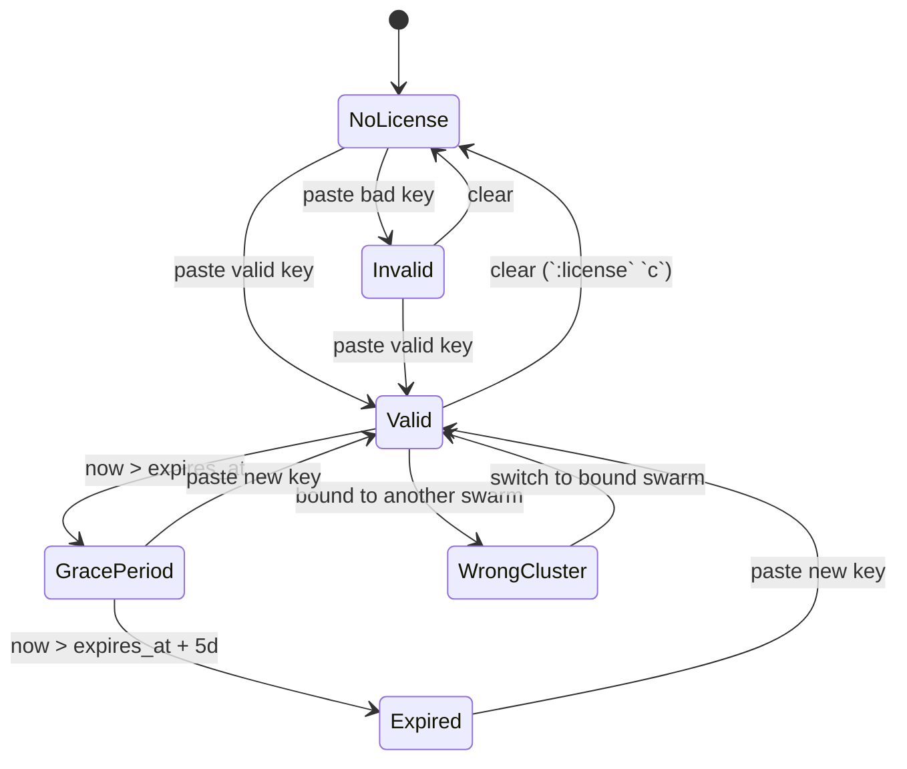

<!--
SPDX-License-Identifier: Apache-2.0
Copyright © 2026 Eldara Tech
-->

# License

SwarmCLI Business Edition runs against a signed license key. This page
covers the model, the activation paths, and the lifecycle states a key
goes through.

## Model

A license key is a single opaque string, cryptographically signed by Eldara
Tech and verified by the `swarmcli` binary offline — nothing phones home, and a
key works on an air-gapped swarm. Keys are versioned, so a key issued today
keeps working when the format gains a field.

What a key records about you:

- **Who it is for** — your customer identifier.
- **Which tier** — `be` (Business Edition) or `trial`. Both grant the same
  feature set today; `trial` is meant to be paired with a short expiry.
- **When it expires**, if ever. A key may be issued without an expiry.
- **Node and user limits**, if any. See [Limits](#limits).
- **Which swarm it is bound to**, if any. See
  [Per-swarm binding](#per-swarm-binding).

What a key does *not* record is a list of features. Entitlements are derived
from the tier, so adding a capability to a tier benefits every outstanding key
for that tier without re-issuing — and no key can claim a feature its tier does
not grant.

## Acquiring a key

Get a key (including a free trial) at [swarmcli.io/be](https://swarmcli.io/be).

## Activation

The active key is the one stored on the connected swarm, as a Docker
Config named `swarmcli-license` (see
[Per-swarm storage](#per-swarm-storage)). That is the only place swarmcli
loads a key from, so that every component agrees on which license is in
force no matter which machine the TUI runs on.

Two *portable* sources let you carry a key to a swarm without re-issuing
it: the `SWARMCLI_LICENSE` environment variable and the file
`~/.config/swarmcli/license.key`. Neither is activated on its own. When
one is present the `:license` view lists it with the keystroke that
installs it into the connected swarm, and the source is preserved
afterwards so you can install the same key on further swarms.

So there are three ways to activate a key, all of which end with it
stored on the swarm:

1. Paste it into the license prompt (see below) or into `:license` `s`.
2. `:license install <path-to-license.key>` from the command bar — see
   [`:license` subcommands](#license-subcommands).
3. Press the listed key on the `:license` view to install from
   `$SWARMCLI_LICENSE` or from `~/.config/swarmcli/license.key`.

All of them require a Docker context pointing at a swarm manager, and all
of them validate the key before storing it.

### The license prompt

The prompt appears when you ask for a Business Edition feature and no
usable key is available — i.e. there's no key, the key is invalid, or the
key is past its grace period. You see one of:

```
No Business Edition license found.

Get a free trial license at: https://swarmcli.io/be

Paste your license key below, or press Enter to continue
with Community Edition.

You can also set the SWARMCLI_LICENSE environment variable.

License key:
```

```
Your license key is invalid.

Paste a valid license key below, or press Enter to continue
with Community Edition.

License key:
```

```
Your license expired on YYYY-MM-DD. The 5-day grace period has ended.
Business Edition features are now disabled.

Paste a new license key below, or press Enter to continue
with Community Edition.

License key:
```

```
This license is bound to swarm <expected-id>.
You are connected to swarm <observed-id>.
Business Edition features are disabled.
Switch context (:contexts) or contact support to rebind.

License key:
```

Pressing **Enter** with no input dismisses the prompt and leaves you in
Community Edition. Pasting a valid key activates Business Edition and
stores the key on the connected swarm, replacing whatever was installed
there before — so renewing an expiring license is a single paste, with no
uninstall step.

If the key verifies but cannot be stored — the Docker context isn't a
swarm manager, or the daemon isn't reachable — the prompt says
`License Not Installed` and names the reason. Business Edition stays off
until the key reaches the swarm: connect to a manager (`:contexts`) and
paste it again.

### `:license` view

Inside the TUI, `:license` shows current state:

| Shown | Meaning |
|---|---|
| Status: Valid | Key verified, not expired, within limits, bound swarm matches (or unbound). |
| Status: Grace Period (N days remaining) | Key expired, features still enabled (see below). |
| Status: Expired | Key past grace; features disabled. |
| Status: No license | No key present. |
| Status: Invalid | The key did not verify, or names a tier this build does not know. |
| Status: Node limit exceeded | Cluster has more nodes than `max_nodes`. |
| Status: User limit exceeded | RBAC store has more users than `max_users`. |
| Status: Wrong swarm (license bound to a different cluster) | The connected swarm differs from the one the license is bound to. See [Per-swarm binding](#per-swarm-binding). |

The view also shows:

- `Source: swarm config (swarmcli-license)` — where the active key was loaded from.
- `Binding: Bound to <id> | Unbound (portable across swarms) | Expected/Observed mismatch` — the current binding state.

Key bindings inside the view:

- `s` — set a new license key (interactive paste, stored on the connected swarm, replacing any key already installed there).
- `c` — clear the current key (with confirmation). Removes the swarm-stored key only; `$SWARMCLI_LICENSE` and `~/.config/swarmcli/license.key` are left alone so the key stays portable to other swarms.

When a portable source is present, the view also lists it under
**Available Local Sources** with the keystroke that installs it into this
swarm.

### `:license` subcommands

| Command | Effect |
|---|---|
| `:license` | Open the license view (default). |
| `:license install <file>` | Install the token in `<file>` into this swarm's Docker Config (`swarmcli-license`). The token is validated before it is stored. Requires a Docker context pointing at a swarm manager. |
| `:license export <file> [--force]` | Write the swarm-stored token back out to `<file>` (mode `0600`), so you can install the same key on further swarms without re-issuing it. Refuses to overwrite an existing file unless `--force` is passed. |
| `:license uninstall` | Remove the swarm-stored license, dropping the swarm back to Community Edition. `$SWARMCLI_LICENSE` and `~/.config/swarmcli/license.key` are left in place so the key stays portable, but neither reactivates on its own. |
| `:license cluster-id` | Print the current swarm's cluster id (useful when contacting support to get a bound license issued). Works with no license loaded. |

`:license install` won't touch a `swarmcli-license` Config that swarmcli
didn't create, so a user-created Config of the same name is never
silently overwritten.

### Renewing a license

Install the new key the same way you installed the first one — paste it
into `:license` `s`, or run `:license install <new-file>`. It replaces
the installed key in place; there is no uninstall step, and it works
whether the old key is still valid, in its grace period, or long expired.

The new key is verified before the old one is removed, so a key that
doesn't verify (or is bound to a different swarm) leaves the installed
one untouched. Between the two there is a sub-second window in which no
license is installed; a Business Edition request landing exactly inside
it is refused once and succeeds on retry.

`:license uninstall` remains available for going back to Community
Edition, and stays the way to clear a `swarmcli-license` Config before
handing a swarm to someone else.

## Per-swarm binding

A license key may be bound to a single Docker Swarm at issuance. There are
three cases:

- **Unbound**: the key verifies on any swarm. This is the legacy / portable
  behaviour; `trial` keys are typically unbound.
- **Bound, matching**: business as usual.
- **Bound, mismatching**: the key is cryptographically valid but is for a
  different swarm. Business Edition features disable and `:license` shows
  `Wrong swarm`; switching back to the bound swarm restores it immediately,
  with no waiting period. If you legitimately need to operate against
  another swarm, get a license issued for that swarm.

### Getting a bound license

Run `:license cluster-id` in swarmcli to see your swarm's id, send that
to support along with your account information, and you'll receive a
bound license file. Install it with `:license install <file>`.

### My cluster was rebuilt — what now?

When a swarm is destroyed and a new one initialized (`docker swarm leave
--force` then `docker swarm init`), the cluster id changes. Your bound
license will not verify against the new cluster.

Resolution: contact support with the new cluster id (`:license
cluster-id` against the new swarm) — sales will reissue a license bound
to the new id. Install the replacement with `:license install <file>`.

Force-restoring a swarm from a backup of `/var/lib/docker/swarm/` (a
documented DR procedure with `docker swarm init --force-new-cluster`)
preserves the cluster id, so the original license keeps working.

## Per-swarm storage

The license is stored as a Docker Config (`swarmcli-license`) on the swarm
itself. That is what makes the following true:

- The license is part of the swarm's Raft state. It's not sitting in a
  file on operator laptops.
- Any operator with a docker context pointing at the swarm reads the
  same license — no per-engineer setup.
- Removing a docker context removes that engineer's access to the
  license (after the next swarmcli restart).

Install with `:license install <file>`. swarmcli marks the Config as its
own so it can distinguish it from any user-created Config of the same name.

### MSPs / consultancies

If you manage swarms for multiple customers, install the customer's
license once into each customer's swarm. Your engineers carry zero
license files — picking the right `docker context` is enough. New
engineers joining the team inherit license access by inheriting docker
contexts, with no extra issuance.

This replaces the older pattern of curating one license file per
customer on each engineer's laptop.

## Lifecycle states



| State | BE features | What the user sees |
|---|---|---|
| Valid | enabled | normal startup, no prompt |
| Grace Period | **enabled** | one-line warning printed to stderr at startup, banner in `:license` view |
| Expired (past grace) | disabled | startup prompt every run until a new key is provided |
| No license | disabled | startup prompt every run |
| Invalid | disabled | startup prompt every run |
| Wrong swarm | disabled | startup prompt naming the expected vs. observed cluster id |

The grace period is **5 days** from `expires_at`. During grace, BE
features remain enabled — this is deliberate, so a quiet renewal cycle
doesn't take a production cluster offline.

## Limits

`max_nodes` and `max_users` are **soft** limits. Exceeding them does not
block any operation; they appear as a warning state in the `:license`
view, and the expiry is recorded on the key at issuance time.

- `max_nodes` is checked against the swarm's current node count, refreshed
  on each TUI update tick.
- `max_users` is checked against the rbac-proxy's user store after each
  RBAC change.

Either limit set to `0` is treated as unlimited.

## Key versioning

Keys carry a version, and each release of swarmcli accepts a range of them.
Additive changes — a new optional property — widen the range at the top, so a
key you already hold keeps working. Only a deliberately breaking change raises
the floor, and a release that does so says as much in its upgrade notes.

In practice this has happened once: per-swarm binding was added without
invalidating anything, and keys issued before it remain valid and portable.

## Privacy

The license key itself never leaves your machine after activation. The
verification is local and offline. No network call is made for license
validation, and none is possible — an air-gapped swarm activates exactly like
a connected one. The unrelated CE version-check behaviour (a single GET to
`https://swarmcli.io/api/v1/version` at startup) can be disabled with
`SWARMCLI_DISABLE_VERSION_CHECK=true`; see the
[README](../README.md#environment-variables).

