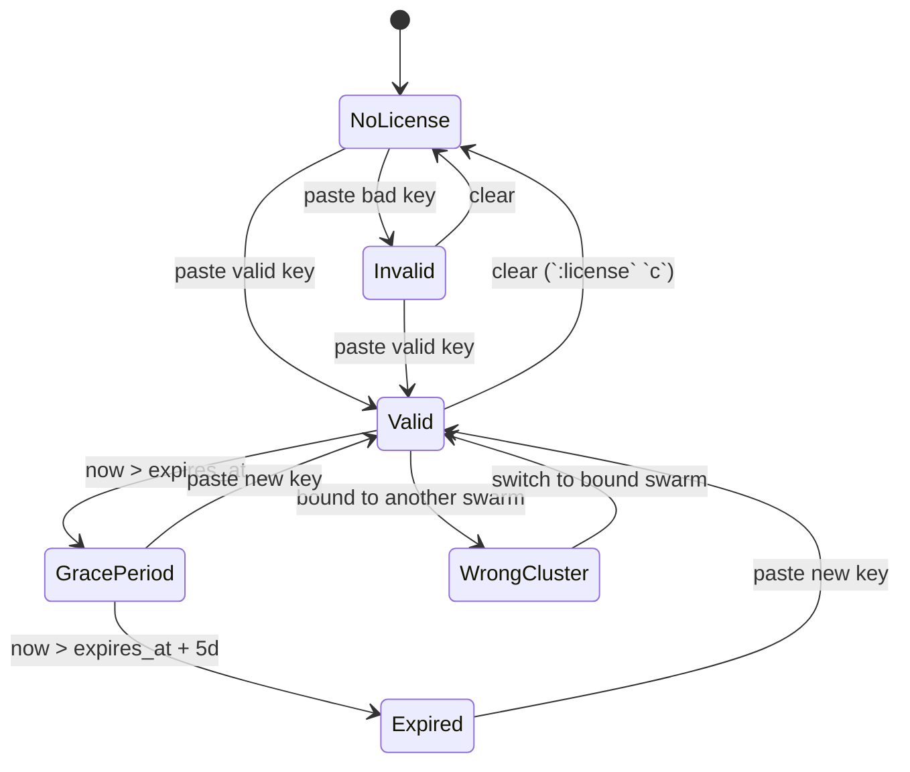
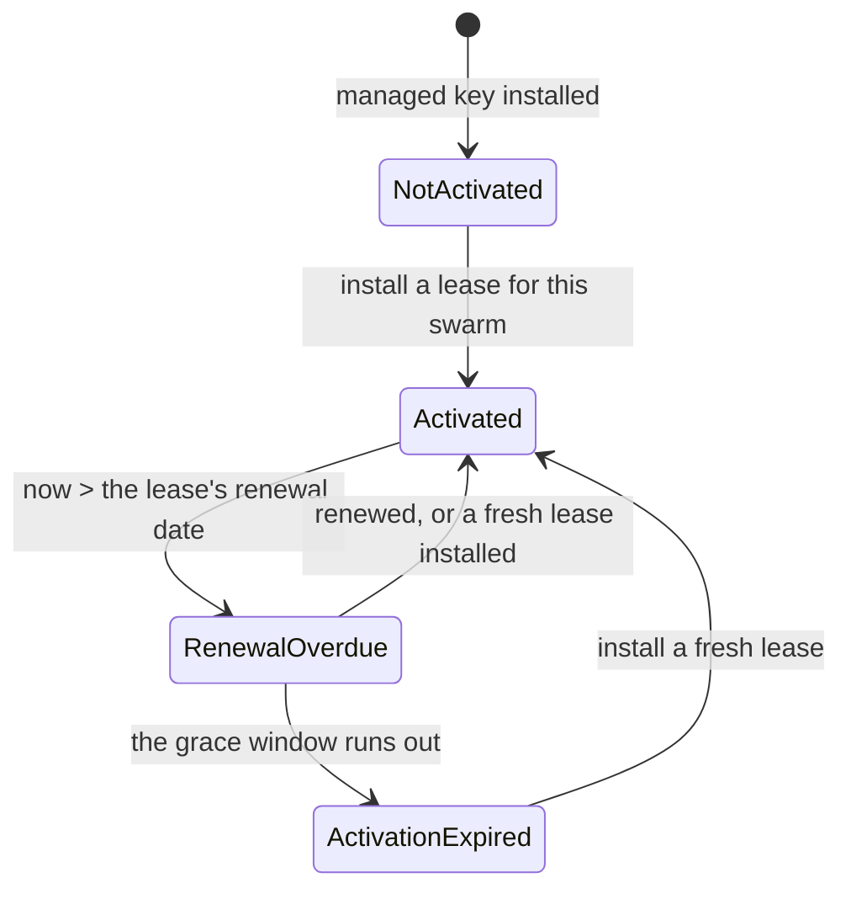

<!--
SPDX-License-Identifier: Apache-2.0
Copyright © 2026 Eldara Tech
-->

# License

SwarmCLI Business Edition runs against a signed license key. This page
covers the model, the activation paths, and the lifecycle states a key
goes through.

## Model

A license key is a single opaque string, cryptographically signed by Eldara
Tech and verified by the `swarmcli` binary offline. Verification never involves
us: swarmcli checks the signature itself, so a key works on an air-gapped
swarm and no outage of ours can disable your features. Keys are versioned, so
a key issued today keeps working when the format gains a field.

Any license may use the network to collect a key we re-signed for it, and a
[managed license](#managed-licenses-activation-is-a-second-step) adds a renewal
step on top — never verification, and there is an offline path for both.
[Privacy](#privacy) says exactly what is sent and when.

What a key records about you:

- **Who it is for** — an identifier for the *account* the key was issued to, not
  for you personally. It is deliberately not your e-mail address: a key is
  exportable by design and lives on your swarm, where anyone who can read a file
  on a node can read every field listed here. Quote the [license
  id](#license-id) rather than this when you contact support — it names one key
  rather than one account. A key signed before this was settled may still carry
  an address; the daily token refresh replaces it (see [Privacy](#privacy)).
- **Which tier** — `be` (Business Edition), `free` or `trial`. All three grant
  the same feature set today, so the tier does not decide which features you
  get; it decides what surrounds the key. A `trial` and a `free` key must carry
  an expiry — from v2.0.0 a key on either tier that does not is refused — and a
  `free` key carries a node allowance somebody actually judges. See [The free
  tier](#the-free-tier).
- **When it expires**, if ever. A `be` key may be issued without an expiry;
  `trial` and `free` may not. A free licence's expiry is not a countdown to the
  end of the tier, because it is rolled forward — see [The free
  tier](#the-free-tier).
- **Node, user and per-node vCPU limits**, if any. See [Limits](#limits).
- **Which swarm it is bound to**, if any, and **how** — see
  [Per-swarm binding](#per-swarm-binding).
- **A license id** — a short `lic_…` string naming this individual license.
  See [License id](#license-id).

What a key does *not* record is a list of features. Entitlements are derived
from the tier, so adding a capability to a tier benefits every outstanding key
for that tier without re-issuing — and no key can claim a feature its tier does
not grant.

## The free tier

There is a permanent free tier, and it is a licence like any other: a signed key
you install into a swarm, verified offline, granting the same features a paid
`be` key grants — the Business Edition features these pages describe, and the
licensed swarmcli-cd features beside them, since one licence covers both
products. It is not a reduced feature set under a different name, and nothing
about installing, renewing or moving it differs from what the rest of this page
describes.

What bounds it is not the features. It is the two things around the key:

- **Three nodes.** The allowance is recorded on the key as `max_nodes`, the same
  field a paid licence carries, and swarmcli does not refuse anything on the
  strength of it — the count is judged elsewhere, and [Limits](#limits) is where
  that is spelled out, because "soft limit" on its own leads a reader to the
  wrong conclusion here.
- **A term, rather than a perpetual grant.** A free key is signed for 90 days,
  and the term is rolled forward for you: it reaches the swarm on the same daily
  token refresh that carries a renewal or a tier change (see
  [Privacy](#privacy)), and it arrives before the date it replaces rather than
  on it. Rolling it forward is the only lever there is — a free licence ends by
  no longer being rolled, never by anything switching off from our side — and
  that is also why the expiry is mandatory rather than optional. A free key with
  no expiry would be a permanent grant on every swarm it reached, and nothing
  could ever end it.

A swarm that cannot reach us keeps the term it was signed with and stops when it
runs out, and there is no offline substitute: a free licence has no lease, so
there is no lease file to hand-carry in its place. Air-gapped and
policy-restricted deployments are what the paid tiers' offline paths are for.

One free licence per account, and it is [bound to one
swarm](#per-swarm-binding) at issuance like any other key — `bind: static`, so
there is **no lease**, and nothing to renew or hand-carry after the key is in.
That is the step a paid licence has and this one does not; getting the key is
still a step, and it is one command:

```bash
swarmcli license activate
```

It prints a short code and a link, waits while you pick the free tier in the
browser, and installs what comes back. Register Cluster in the dashboard is the
same thing done by hand — see [Getting a bound
license](#getting-a-bound-license) — and either way installing the key is the
end of it. Moving it to another swarm is the same dashboard action as for a paid
licence, and asking for a second free key is refused naming the cluster the
first one is on.

The tier is new: a free key is accepted from v2.0.0. An older swarmcli does not
know the word `free` — it verifies the signature, finds a tier it has no
entitlements for, and reports `Invalid` on the `:license` view. The key is fine;
upgrade rather than ask for a different one. See [Key
versioning](#key-versioning).

## Acquiring a key

Get a key at [swarmcli.io/be](https://swarmcli.io/be) — a
[free-tier](#the-free-tier) key, a time-boxed trial, or a paid subscription. All
three are the same kind of artifact, are installed the same way, and everything
below applies to each of them.

## Start to finish

The rest of this page is organised by mechanism. This section is the same
material in the order you actually meet it, on a swarm that has never held a
license. Every command needs a Docker context pointing at a **swarm manager**.

**1. Get a key.** One command, from a machine that can reach us:

```bash
swarmcli license activate
```

It reads this swarm's cluster id, prints a short code and a link, opens a
browser if there is one, and waits while you choose — the [free
tier](#the-free-tier), a trial, or a paid plan. What comes back is installed
into the swarm before the command returns. It refuses on a swarm that already
holds a working license, and makes no call at all when
`SWARMCLI_DISABLE_LICENSE_RENEWAL` is set.

The dashboard is the same thing done by hand: **Register Cluster** at
[swarmcli.io/licenses](https://swarmcli.io/licenses), which wants the cluster id
`:license cluster-id` prints.

**2. Install a key you were sent.** Skip this if step 1 did it for you.

```bash
swarmcli license install ~/license.key       # or :license install ~/license.key
```

or press `s` on the `:license` view and paste. Either way the key is verified
before it is stored, and it is stored on the swarm rather than on your laptop —
see [Per-swarm storage](#per-swarm-storage).

**3. Activate, if the license is managed.** A paid license is signed
`bind: managed`: the key names your swarm, and the swarm is then activated for
it with a short-lived [lease](#managed-licenses-activation-is-a-second-step).
Until the lease lands, `:license` says **Not activated for this swarm** and
Business Edition features stay off. On a swarm that can reach us this takes care
of itself within a few minutes; air-gapped, it is a file:

```bash
swarmcli license lease install ~/swarm.lease
```

A [free-tier](#the-free-tier) license is signed `bind: static` and has no lease,
so this step does not exist for it. Step 2 was the whole of it.

**4. Confirm.**

```bash
swarmcli license status
```

Exit `0` means the license grants its features; `1` means it does not. In the
TUI, `:license` says the same thing at more length, and the edition label in the
header reads *Business Edition*.

**5. Renewal is not a thing you do.** A rolled [free-tier](#the-free-tier) term,
a plan change and a lease renewal all arrive over the same requests, attempted
on a timer and again whenever you open `:license`. On a swarm nobody opens a TUI
against, [`:bootstrap`](bootstrap.md) deploys a `licence-renewer` service that
makes them for you. See [Renewing a license](#renewing-a-license).

**6. What running out looks like.** The key's `expires_at` passes, five days of
[grace](#lifecycle-states) follow with every feature still on, and then features
stop. Nothing prompts you at startup: the status bar carries the state and the
license dialog opens when a gated feature is next asked for. Installing a fresh
key at any point in that sequence is a single paste, with no uninstall step.

## Activation

The active key is the one stored on the connected swarm, as a Docker
Config named `swarmcli-license` (see
[Per-swarm storage](#per-swarm-storage)). That is the only place swarmcli
loads a key from, so that every component agrees on which license is in
force no matter which machine the TUI runs on.

Two *portable* sources let you carry a key to a swarm without re-issuing
it: the `SWARMCLI_LICENSE` environment variable and the file
`~/.config/swarmcli/license.key`. Neither is activated on its own. When
one is present the `:license` view lists it with the keystroke that
installs it into the connected swarm, and the source is preserved
afterwards so you can install the same key on further swarms.

So there are three ways to activate a key, all of which end with it
stored on the swarm:

1. Paste it into the license prompt (see below) or into `:license` `s`.
2. `:license install <path-to-license.key>` from the command bar — see
   [`:license` subcommands](#license-subcommands).
3. Press the listed key on the `:license` view to install from
   `$SWARMCLI_LICENSE` or from `~/.config/swarmcli/license.key`.

All three are things a person does at a TUI. A machine has its own path to
the same Docker Config — `swarmcli license install <file>` for a key you
already hold, `swarmcli license activate` for one you do not. See [Without
the TUI](#without-the-tui-swarmcli-license).

### Managed licenses: activation is a second step

A **managed** license names its swarm in the key, exactly as a key bound at
issuance does, and is then *activated* for that swarm. Installing the key is
the first step; the second is an **activation lease** — a short-lived signed
artifact naming that license and that swarm.

On a swarm that can reach us, the second step takes care of itself. A managed
license with no lease installed is due for renewal by definition, and the
check runs every few minutes and again whenever you open `:license` — so
activation follows the key install on its own, and renewal continues from
there. Installing the key is the only thing you do:

```
:license install ~/license.key
```

Until a lease is in place, `:license` reports **Not activated for this
swarm** and Business Edition features stay off. That is deliberate: with a
managed license the lease is the binding, so its absence is an answer rather
than an unknown.

An air-gapped swarm cannot ask, so it is activated from a lease file you are
sent instead:

```
:license lease install ~/swarm.lease
```

or, on a site where the deployment is scripted precisely because nobody is
sitting at a terminal, the same thing from a shell:

```bash
swarmcli license lease install ~/swarm.lease
```

A lease carries its own dates. The default is **30 days to renewal and a
further 30 days of grace** — features keep working through the grace window
while the renewal is overdue. Longer leases are available for air-gapped and
low-touch deployments, and are worth asking for **before** your first outage
rather than after: `:license` will tell you which state you are in, but only if
somebody opens it.

A paid license issued today is signed `managed`; a [free-tier](#the-free-tier)
key is signed `static` and has no lease. Keys issued before managed binding
existed are bound at issuance, and nothing about them changes.

All of them require a Docker context pointing at a swarm manager, and all
of them validate the key before storing it.

### The license prompt

The prompt appears when you ask for a Business Edition feature and no
usable key is available — i.e. there's no key, the key is invalid, or the
key is past its grace period. It is never shown at startup; see
[Lifecycle states](#lifecycle-states).

Every state is the same dialog, and only the message inside it changes.
With no license at all:

```
 License

No Business Edition license found.

Swarm cluster ID:
  <cluster-id>

Get a license at:
  https://swarmcli.io/licenses?cluster_id=<cluster-id>

Paste your license key:
>

<Enter> submit  <Esc> cancel  <ctrl+o> open
```

`<ctrl+o>` opens the link the message names, `<ctrl+y>` copies it, and
`<ctrl+g>` copies the bare cluster id — for filling the form in on another
machine without mouse-selecting an id out of a bordered box. The rest of
this section quotes only the message, since the frame around it does not
change.

**Invalid** — the key did not verify:

```
Your license key is invalid.
```

**Expired** — past the grace window:

```
Your license expired on 2026-03-01.
The 5-day grace period has ended.
Business Edition features are now disabled.

Renew, or ask about the free tier for up to 3 nodes:
  https://swarmcli.io/licenses?cluster_id=<cluster-id>
```

**Grace period** — expired, features still on:

```
Your license expired on 2026-03-01.
Grace period: 3 of 5 days remaining.

Renew at:
  https://swarmcli.io/licenses?cluster_id=<cluster-id>
```

**Wrong swarm** — the key names a different cluster:

```
This license is bound to swarm <expected-id>.
You are connected to swarm <observed-id>.
Business Edition features are disabled.

Switch context (:contexts), or request a license for this swarm at:
  https://swarmcli.io/licenses?cluster_id=<observed-id>
```

**Newer than this build** — nothing is wrong with the key:

```
This license is newer than this build of swarmcli.
The key is fine; this binary cannot read it.

Upgrade swarmcli.
```

**Valid but not saved** — the signature verified and the swarm did not
take it, so pasting the same key again is the right move once the reason
is fixed:

```
Your license key is valid but is not installed in this swarm:
  <reason>

Business Edition features stay disabled until it is stored in the
swarm. Connect to a swarm manager (:contexts), then try again.
```

Three more belong to a [managed
license](#managed-licenses-activation-is-a-second-step), and are about the
activation lease rather than the key. **Not activated** — the key is
installed and the swarm has no lease:

```
This license is installed, but this swarm is not activated yet.

Install the lease file you were sent:
  :license lease install <file>
```

**Renewal overdue** — the lease's renewal date has passed, and features
stay on to the date named:

```
This swarm's activation is overdue for renewal.
Business Edition features stay on until 2026-04-15.

Renew it, or install a fresh lease:
  :license lease install <file>
```

**Activation expired** — the grace window ran out:

```
This swarm's activation has expired.
Business Edition features are disabled.

Renew it, then install the fresh lease:
  :license lease install <file>
```

Pressing **Enter** with no input dismisses the prompt and leaves you in
Community Edition. Pasting a valid key activates Business Edition and
stores the key on the connected swarm, replacing whatever was installed
there before — so renewing an expiring license is a single paste, with no
uninstall step.

If the key verifies but cannot be stored — the Docker context isn't a
swarm manager, or the daemon isn't reachable — the prompt says
`License Not Installed` and names the reason. Business Edition stays off
until the key reaches the swarm: connect to a manager (`:contexts`) and
paste it again.

### `:license` view

Inside the TUI, `:license` shows current state:

| Shown | Meaning |
|---|---|
| Status: Valid | Key verified, not expired, bound swarm matches (or unbound). |
| Status: Grace Period (N days remaining) | Key expired, features still enabled (see below). |
| Status: Expired | Key past grace; features disabled. |
| Status: No license | No key present. |
| Status: Invalid | The key did not verify, or names a tier this build does not know. |
| Status: Wrong swarm (license bound to a different cluster) | The connected swarm differs from the one the license is bound to. See [Per-swarm binding](#per-swarm-binding). |
| Status: Valid, but not saved: `<reason>` | The signature verified and the swarm did not take the key. Named rather than reported as an unknown, because the reason is the remedy. |
| Status: Newer than this build (upgrade swarmcli) | The key's version is above what this build accepts. The key is fine — see [Key versioning](#key-versioning). |
| Status: Not activated for this swarm | A [managed](#managed-licenses-activation-is-a-second-step) key with no lease. |
| Status: Activated — renewal overdue | The lease's renewal date has passed; features are still on. |
| Status: Activation expired | The lease's grace window ran out; features are off. |

The view also shows:

- `Source: swarm config (swarmcli-license)` — where the active key was loaded from.
- `Bound to: <id>` — the binding line. It reads `Unbound (portable across
  swarms)` for a legacy unbound key, `Bound to: <id> (waiting for swarm
  observation)` before the first swarm read lands, and `Expected: <id>` over
  `Observed: <id> (mismatch)` on the wrong swarm.
- A [managed](#managed-licenses-activation-is-a-second-step) license writes the
  same line as `Managed — …`, and names the exact state because the remedies
  differ: `activated for <id>, renews <date>`; `renewal overdue, features off
  in N day(s) (<date>)`; `activation expired <date>`; `not activated for this
  swarm (<id>)`; `the installed lease is not for this swarm's licence`, when
  the wrong lease file was pasted; `expected: <id> / Observed: <id>
  (mismatch)`. Two more are about this host rather than the license: `this
  host's clock is behind the newest time this swarm has seen`, which no fresh
  lease lifts, and `this activation does not begin until <timestamp>` for a
  future-dated lease.
- `Nodes: 12 of 10 — nothing is switched off`, with a portal link beside it —
  shown only when the swarm has more nodes than `max_nodes`. It is a report and
  not a status: the `Status:` line above is unaffected and every feature stays
  on. See [Limits](#limits).
- `vCPU: 48 of 16 per node — nothing is switched off`, with the same portal
  link — shown only when the swarm's largest node is bigger than
  `max_vcpus_per_node`. `per node` is in the line because the two figures
  otherwise read as the same kind of number and they are not: one counts the
  swarm, the other measures its biggest machine. Also a report and not a status.
  See [Limits](#limits).
- `Allowance: 5 of 3 nodes, as the licence service sees it`, and beside it
  `Term: stops rolling 2026-09-12 unless the count comes down` — what the
  licence service last said about the allowance, shown only while it says this
  licence is over it, and abbreviated into the status bar as well because the
  swarm nobody opens `:license` on is the one that lapses. Also a report and not
  a status. See [Limits](#limits).
- `Auto-renewal: no licence-renewer service on this swarm` — shown when the
  swarm was bootstrapped before the `licence-renewer` service existed, so
  nothing renews the licence while swarmcli is closed. See [Bootstrap — the
  `Auto-renewal:` warning](bootstrap.md#the-auto-renewal-warning-on-license).

Key bindings inside the view:

- `s` — set a new license key (interactive paste, stored on the connected swarm, replacing any key already installed there).
- `c` — clear the current key (with confirmation). Removes the swarm-stored key only; `$SWARMCLI_LICENSE` and `~/.config/swarmcli/license.key` are left alone so the key stays portable to other swarms.

When a portable source is present, the view also lists it under
**Available Local Sources** with the keystroke that installs it into this
swarm.

### `:license` subcommands

| Command | Effect |
|---|---|
| `:license` | Open the license view (default). |
| `:license install <file>` | Install the token in `<file>` into this swarm's Docker Config (`swarmcli-license`). The token is validated before it is stored. Requires a Docker context pointing at a swarm manager. |
| `:license export <file> [--force]` | Write the swarm-stored token back out to `<file>` (mode `0600`), so you can install the same key on further swarms without re-issuing it. Refuses to overwrite an existing file unless `--force` is passed. |
| `:license uninstall` | Remove the swarm-stored license, dropping the swarm back to Community Edition. `$SWARMCLI_LICENSE` and `~/.config/swarmcli/license.key` are left in place so the key stays portable, but neither reactivates on its own. |
| `:license cluster-id` | Print the current swarm's cluster id (useful when contacting support to get a bound license issued). Works with no license loaded. |
| `:license id` | Print the [license id](#license-id) — the `lic_…` string to quote in a support ticket. |
| `:license lease install <file>` | Activate a [managed license](#managed-licenses-activation-is-a-second-step) on this swarm from a lease file. Verified before it is stored, and refused with the reason if the lease is for another swarm, for another license, or expired. |
| `:license lease show` | Show the installed lease: which license and swarm it activates, when it renews, and when it stops. |
| `:license renew` | Ask the license service for a fresh lease now, rather than waiting for the automatic attempt. Only useful for a managed license; the `:license` page reports what the service last answered. |

`:license install` won't touch a `swarmcli-license` Config that swarmcli
didn't create, so a user-created Config of the same name is never
silently overwritten.

There is no subcommand that moves a license to another swarm — see
[Moving a managed license](#moving-a-managed-license-to-another-swarm).

### Without the TUI: `swarmcli license`

The whole lifecycle is reachable without a person at a TUI:

```bash
swarmcli license status  [--json]                    # what this swarm holds
swarmcli license sync    [--json] [--interval <d>]   # renew this swarm's activation now
swarmcli license install <file>                      # store a key you already hold
swarmcli license activate                            # get a key for this swarm, in one command
swarmcli license lease install <file>                # activate from a lease file
swarmcli license id                                  # print the license id support asks for
```

They all read the license from the swarm's Docker Config exactly as the TUI does,
so they need a Docker context pointing at a swarm manager, and the ones that write
verify first, so an artifact that does not verify never reaches the swarm from
here either. `status` prints one `key=value` per line, or the same fields as an
object with `--json`: `status`, `grants`, `tier`, `customer`, `license_id`,
`bind`, `cluster_id`, `bound_cluster_id`, `expires_at`, `nodes`, `max_nodes`,
`vcpus_max`, `max_vcpus_per_node`, `features`, and — when a lease is installed —
`lease_id`, `lease_expires`,
`lease_hard_stop` and `lease_error`. Every field is omitted rather than zeroed
when there is nothing to say, so absence is not a state.

`sync` prints the same report plus the fields that only exist once the license
service has answered: `renewal_at`, `renewal_result`, `renewal_code`,
`retry_after`, `portal`, and the six [allowance](#limits) fields
`entitlement_status`, `entitlement_nodes`, `entitlement_max_nodes`,
`entitlement_vcpus_max`, `entitlement_max_vcpus_per_node` and
`entitlement_term_ends_at`. They are absent from `status` because `status`
makes no call at all.

The exit codes do not all answer the same question, and that is what makes them
useful in a cron job. A verb that finishes an activation answers *does this
swarm's license grant its features*; a verb that performs one step of one answers
*did the step happen*.

| | `0` | `1` | `2` |
|---|---|---|---|
| `status` | the license grants its features — including while degraded in a grace window | it does not | usage error |
| `activate` | the same, having just activated the swarm | it does not | usage error |
| `lease install` | the same, having just installed the lease | the lease did not install, or the license still does not grant | usage error |
| `sync` | renewed, or there was nothing to renew | the renewal failed | usage error |
| `install` | the key is stored | it is not | usage error |

So a `503` from our service exits `1` from `sync` and `0` from `status` on the
same swarm, and both are correct: the renewal failed, and the license is fine. By
the same rule `install` exits `0` on a managed key that grants nothing yet, which
is also correct — a managed key is not an activated license until a lease arrives.

This exists for deployments where nobody opens the TUI for weeks — a controller
or a CI runner holding a managed license. A daily `swarmcli license sync` keeps
the activation current without a human, and a `swarmcli license status` that
starts exiting non-zero is the alert that something needs one. With `--interval`
(minimum `1h`) `sync` stays running and repeats on that period instead of
exiting, which is the shape the `licence-renewer` service uses; in that mode a
failed pass logs and waits, because a service that exited on a transient outage
would be restarted into a crash loop.

`activate` is the one-command path for a swarm that can reach us. It opens an
activation, prints a short code and a link, waits while you confirm in a browser,
and installs what comes back through the same path `install` uses. It refuses on
a swarm that already holds a license that grants — replacing a working one is
what `install` is for — and it makes no outbound call at all when
`SWARMCLI_DISABLE_LICENSE_RENEWAL` is set.

`lease install` is `activate`'s offline twin: the same activation, from a lease
file somebody carried in, for the sites where `activate` cannot reach us and
nobody is sitting at a TUI. It checks that the lease verifies and that it names
this license and this swarm before anything is written. There is no `lease show`
here and no `--json` on it — `status` already reports the installed lease, in
both its forms, and a second rendering of those fields is a second place for them
to drift.

`sync` never moves a license: it renews the swarm it is run against, and takes no
argument that could name another one.

Renewal can be switched off entirely with `SWARMCLI_DISABLE_LICENSE_RENEWAL=true`
— see [Privacy](#privacy).

### Renewing a license

*Renewing the key.* Install the new key the same way you installed the first one — paste it
into `:license` `s`, or run `:license install <new-file>`. It replaces
the installed key in place; there is no uninstall step, and it works
whether the old key is still valid, in its grace period, or long expired.

The new key is verified before the old one is removed, so a key that
doesn't verify (or is bound to a different swarm) leaves the installed
one untouched. Between the two there is a sub-second window in which no
license is installed; a Business Edition request landing exactly inside
it is refused once and succeeds on retry.

`:license uninstall` remains available for going back to Community
Edition, and stays the way to clear a `swarmcli-license` Config before
handing a swarm to someone else.

*Renewing a managed license's activation.* That is a lease rather than a key, and
in the normal case you do nothing: swarmcli renews it for you, roughly a third of
the way through the lease's window and again whenever you open `:license`. Renewing
early and often is the point — a lease renewed on the day it expires is a lease
that fails in exactly the case the grace window exists for. The `:license` page
reports what the service last answered, and a renewal that fails changes nothing:
the installed lease keeps working to the end of its own window.

Two manual paths, for when it does not happen by itself:

- **`:license renew`**, or **`swarmcli license sync`** for a machine — ask now.
- **`:license lease install <new-lease-file>`**, or `swarmcli license lease
  install <new-lease-file>` for a machine — install a lease you were sent as a
  file, which is the air-gapped path and the recovery path. Installing a lease
  never removes the working one first, so a swarm is never briefly unactivated,
  and installing the same lease twice does nothing.

Your key is untouched either way — a renewal of the activation is not a reissue
of the license.

## Per-swarm binding

A license key may be bound to a single Docker Swarm. There are three
binding modes, and `:license` names which one you hold.

- **Unbound**: the key verifies on any swarm. Legacy only — issuance refuses
  to sign an unbound key, trials included, so no key issued today is one of
  these.
- **Bound at issuance** (*static*): the swarm is named in the key when it is
  signed. Matching is business as usual; on any other swarm the key is
  cryptographically valid but Business Edition features disable and
  `:license` shows `Wrong swarm`. Switching back restores it immediately,
  with no waiting period. Every [free-tier](#the-free-tier) key is one of
  these, which is why a free licence needs no lease.
- **Managed**: the swarm is named in the key as above, but the binding is also
  kept current — features work only while the swarm holds a live lease, which
  it renews by itself. See
  [Managed licenses](#managed-licenses-activation-is-a-second-step). Moving it
  to another swarm is a dashboard action that issues a new key, and is allowed
  at most once per lease window — see [Moving a managed
  license](#moving-a-managed-license-to-another-swarm).

### Moving a managed license to another swarm

Rebinding is an account action, not a client one: there is no swarmcli
command that moves a license, and there never will be. A license key is
exportable on purpose — `:license export` is a supported command — so if
holding a key were enough to move it, a copied key would be enough to take a
swarm's license away from it.

So a move is done from your account with us, it is rate-limited, and it is
recorded. Use **Unbind Cluster** at
[swarmcli.io/licenses](https://swarmcli.io/licenses), let the new swarm
activate itself, and the old swarm stops being licensed when its own lease
runs out. A lease that has been issued cannot be recalled, so a
managed license moves at most once per lease window — 60 days at the default
30 days plus 30 days of grace — and the refusal names the date the next move
becomes possible.

### Getting a bound license

Sign in at [swarmcli.io/licenses](https://swarmcli.io/licenses) and use
**Register Cluster**. It asks for the swarm's cluster id — read it with
`:license cluster-id`, or press `g` on the `:license` view — and for an
optional alias, so that a later list of swarms is readable. The key is signed
bound to that swarm and shown on the license's card; copy it and install it
with `:license install <file>`, or by pressing `s` on the `:license` view.

Following the link from the license prompt opens that page with the cluster
id already filled in, so it never has to be retyped.

### My cluster was rebuilt — what now?

When a swarm is destroyed and a new one initialized (`docker swarm leave
--force` then `docker swarm init`), the cluster id changes. Your bound
license will not verify against the new cluster.

With a **managed** license this is self-service in the sense that matters:
the key you hold is still your key. Move it to the new swarm as above and the
new swarm activates itself, or takes a lease file if it is air-gapped. No
reissued key, and nothing to uninstall first.

With a license **bound at issuance**, do it yourself from the dashboard:
**Unbind Cluster** on the license's card, then **Register Cluster** with the
new id (`:license cluster-id` against the new swarm). Unbinding clears the
issued key, so the old key stops working — which is what makes handing out a
replacement safe — and registering issues one bound to the new swarm. The
step is not optional: binding a license that already names a different swarm
is refused with *"This license is already bound to a different Swarm. Please
unbind it first."* A license bound at issuance may be moved this way as often
as you need. Install the replacement with `:license install <file>`.

**Unbind Cluster** is offered for any bound license, subscription-backed or
not — it is `swarm_id` that decides whether the button is there, and the
issuing side checks only that the license is yours. A free-tier license moves
this way too, and it is the verb to use rather than Delete, which throws the
one-per-account row away with the binding.

The one restriction is the managed move cap, and it applies to **managed**
licenses only: a lease that has been issued cannot be recalled, so unbinding is
refused until the previous swarm's lease window has run out, and the refusal
names the date the next move becomes possible. A license bound at issuance —
every free-tier key among them — has no lease and so no cap.

Force-restoring a swarm from a backup of `/var/lib/docker/swarm/` (a
documented DR procedure with `docker swarm init --force-new-cluster`)
preserves the cluster id, so the original license keeps working.

## Per-swarm storage

The license is stored as a Docker Config (`swarmcli-license`) on the swarm
itself. That is what makes the following true:

- The license is part of the swarm's Raft state. It's not sitting in a
  file on operator laptops.
- Any operator with a docker context pointing at the swarm reads the
  same license — no per-engineer setup.
- Removing a docker context removes that engineer's access to the
  license (after the next swarmcli restart).

Install with `:license install <file>`. swarmcli marks the Config as its
own so it can distinguish it from any user-created Config of the same name.

### MSPs / consultancies

If you manage swarms for multiple customers, install the customer's
license once into each customer's swarm. Your engineers carry zero
license files — picking the right `docker context` is enough. New
engineers joining the team inherit license access by inheriting docker
contexts, with no extra issuance.

This replaces the older pattern of curating one license file per
customer on each engineer's laptop.

## Lifecycle states



A **managed** license has three states of its own, all about the activation
lease rather than the key:



| State | BE features | What the user sees |
|---|---|---|
| Valid | enabled | normal startup, nothing to see |
| Grace Period | **enabled** | banner in `:license` view, and the days remaining in the status bar |
| Expired (past grace) | disabled | `No valid license · Community Edition · install via :license` in the status bar, and the prompt when a gated feature is asked for |
| No license | disabled | the same status-bar suffix, and the same prompt on a gated request |
| Invalid | disabled | the same status-bar suffix, and the same prompt on a gated request |
| Wrong swarm | disabled | the prompt names the expected and the observed cluster id |
| Not activated for this swarm | disabled | `:license` names the swarm and the command that activates it |
| Activated — renewal overdue | **enabled** | countdown to the day features stop, on `:license` and in the status bar |
| Activation expired | disabled | `:license` says renew, not activate |
| Newer than this build | disabled | upgrade swarmcli; the key is fine |

Nothing in that column is a startup prompt: an unlicensed or expired start
is passive. The edition label drops to *Community Edition*, the status bar
grows a suffix saying so, and the licence dialog opens just-in-time — when a
gated feature is actually requested, and not before. So a swarm that nobody
asks a Business Edition question of never shows a modal at all.

The grace period is **5 days** from `expires_at`. During grace, BE
features remain enabled — this is deliberate, so a quiet renewal cycle
doesn't take a production cluster offline. A managed license's renewal
window works the same way and for the same reason: features stay on while
the renewal is overdue, and the countdown says how long that lasts.

Being over a node allowance is deliberately not one of these states. It is a
report rather than a status, it takes nothing away on the day it appears, and
the state it eventually leads to is the ordinary `Expired` above — see
[Limits](#limits).

Two states are worth telling apart, because the fix is different and only
one of them involves us. **Not activated** means the swarm has no lease —
install the one you were sent. **Activation expired** means it had one and
the window ran out — ask for a fresh lease.

## License id

Every license issued now carries a short identifier, shown on `:license` and
printable with `:license id`:

```
lic_FRRW-J1KD-3294-HD7X-NQ1N-T27W-MW
```

Quote it when you contact support. Your customer identifier names *you*, and
a customer running three swarms holds three keys that differ only in which
swarm they name — the license id is what says which one you mean.

It is not a secret and not a credential: it appears in logs and tickets, and
nothing anywhere grants access on the strength of it. The key remains the only
thing that proves entitlement.

## Limits

`max_nodes`, `max_users` and `max_vcpus_per_node` are **soft** limits *in the
binary*: swarmcli reports what it observes and never denies on a count.
Exceeding any of them blocks no operation, changes no status the `:license` view
reports and switches no feature off — on every tier, the free one included — and
the expiry is recorded on the key at issuance time.

- `max_nodes` is compared against the swarm's node count, refreshed on each
  TUI update tick. Over the limit, `:license` reports the pair and leaves
  every feature on — see [`:license` view](#license-view).
- `max_vcpus_per_node` is compared against **the largest single node** in the
  swarm, because the limit is stated per node: the swarm is inside it exactly
  when its biggest machine is. Over it, `:license` grows a `vCPU:` line reading
  `48 of 16 per node`, and — as with the node count — every feature stays on.
  Only nodes that are `Ready` are measured. A node that is down reports whatever
  size it last told the manager, so counting it would make the figure a memory
  of a machine rather than an observation of the swarm; draining your largest
  node therefore lowers the number, which is correct and occasionally
  surprising. A node advertising a fractional core rounds down.
- `max_users` is compared against nothing. The number is recorded on the key,
  but no part of the product counts users against it.

Any of them set to `0` is treated as unlimited, and a key issued before a limit
existed carries no value for it and is unlimited in the same way. Keys predating
the per-node vCPU allowance are the current example: they name none, so nothing
is compared and the `vCPU:` line cannot appear.

### The node allowance is judged elsewhere

Soft in the binary is not the same as unbounded, and on the [free
tier](#the-free-tier) the difference is the whole of the tier's boundary. Every
licensing request reports the node count this swarm observed (see
[Privacy](#privacy)), and on a free licence that count is compared against the
allowance *there* rather than here. Nothing switches off when it is exceeded.
What is at stake is the roll of the term:

1. Over the allowance, the next answer says so, and `:license` grows an
   `Allowance:` line and a `Term:` line naming **the date after which the term
   stops being rolled forward**; the status bar carries a short form of the
   same. Every feature stays on, the `Status:` line is unchanged, and renewals
   and refreshes carry on exactly as before.
2. Come back under the allowance before that date and the clock stops. The
   report goes quiet and the term rolls again.
3. Stay over it, and on that date nothing happens — which is the part worth
   knowing in advance. The licence keeps working until the expiry already signed
   into the key, then through the [grace period](#lifecycle-states), and only
   then do Business Edition features stop. How long that is depends on where in
   the term the swarm was when the rolling stopped: it may be days or most of a
   year, and the `Expires:` line on `:license` is the date to plan around.

So an exceeded allowance is a dated warning rather than an outage, and the
outage it can become arrives long after the warning that named it. Bringing the
count back under the allowance or moving to a paid licence resolves it, at any
point before the term runs out.

Two node figures can be on screen at once, and they are allowed to disagree. The
`Nodes:` line is this process's own count against the allowance signed into the
key; the `Allowance:` line is what the licence service last recorded and last
decided. Each names its source, so a stale report beside a fresh count is two
views of one swarm rather than a contradiction.

`swarmcli license status` does not carry either of the service's two lines: it
makes no call, so it reports the observed count and the signed `max_nodes` and
nothing the service said about them. `swarmcli license sync` does make the call,
and prints what came back as six fields — `entitlement_status`,
`entitlement_nodes`, `entitlement_max_nodes`, `entitlement_vcpus_max`,
`entitlement_max_vcpus_per_node` and `entitlement_term_ends_at`, the last being
the date after which the term stops being rolled forward. They are
the `:license` page's `Allowance:` and `Term:` lines in machine-readable form,
in both the `key=value` and the `--json` output, and they are absent when the
answer carried no report.

## Key versioning

Keys carry a version, and each release of swarmcli accepts a range of them.
Additive changes — a new optional property — widen the range at the top, so a
key you already hold keeps working. Only a deliberately breaking change raises
the floor, and a release that does so says as much in its upgrade notes.

In practice this has happened once: per-swarm binding was added without
invalidating anything, and keys issued before it remain valid and portable.

A tier is not a version, and the two fail differently. A key whose *version* is
newer than the build reports `Newer than this build`; a key naming a tier the
build has no entitlements for — a `free` key on a swarmcli that predates the
free tier — reports `Invalid`. Both are fixed by upgrading swarmcli, and neither
is a reason to ask for a different key.

## Privacy

**Validation is always local and offline.** swarmcli verifies the signature on
your key itself, on every kind of license. No network call is made to decide
whether your license is valid, and none is possible — there is no server whose
answer swarmcli would accept over its own check, which is also why an outage of
ours cannot disable your features.

**There are two requests, and only the second is managed-only.** Both send the
same small set of fields, and one environment variable switches off both.

The first is a **token refresh**, made by every license that carries a
[license id](#license-id) — including unbound and bound-at-issuance ones. Your
tier, node count and binding mode are *signed*, so changing any of them means
re-signing your key, and a key we re-signed is no use sitting on our side. Once
a day swarmcli asks whether we hold different bytes for the license it already
has, and installs them if we do. It is how a renewal, a tier change or a rolled
[free-tier term](#the-free-tier) reaches your swarm without you copying a key
out of the dashboard by hand. Nothing is written unless the bytes actually
differ.

The second is a **lease renewal**, and only a managed license makes it: the
activation lease expires, so getting the next one means asking for it.

Both requests send:

- **your license key**, as the credential proving the request is yours. We
  issued and signed it, so it tells us nothing about you we did not already
  know — but it is accurate to say the key is transmitted, over TLS, rather
  than staying on the machine;
- the **license id** (`lic_…`) — which license is asking;
- the **cluster id** of the swarm it is asking for;
- the **number of nodes** in the swarm, once swarmcli has observed one. A single
  integer, and the count the [node allowance](#limits) is judged against; it is
  left out altogether until the first observation lands, because a zero would
  claim a swarm with no nodes rather than a swarm not yet looked at;
- **two figures about node size**, on the same terms: the **vCPU count of the
  largest node** in the swarm, and **how many nodes exceed** the [per-node vCPU
  allowance](#limits) your key names. Both are single integers about the swarm
  as a whole. The first is omitted until something has been observed; the second
  is omitted when your key names no allowance, and is `0` — not omitted — when
  it names one and nothing is over it, because "we counted and found none" is a
  different fact from "there was nothing to count against";
- the **product and version** making the request — `swarmcli-be` from this
  binary or `swarmcli-cd` from the controller, beside the version, because one
  license covers both products and the service has to know which one is
  asking; and
- the time and network origin of the request, as with any HTTPS call.

Nothing else. Not your services, images, users, configuration, node names,
addresses or roles, or anything else read from your Docker daemon — swarmcli
does not gather it and the request has nowhere to put it.

Every figure above is about the swarm rather than about any machine in it. The
node count is a count — how many, never which ones or what runs on them — and
the two size figures are the same kind of statement: the largest node's vCPU
count identifies no node, and the number over the allowance is a tally. There is
no per-node breakdown in the request, and no field one could be written into.

Four things about these requests are worth being precise on, because they are
the questions people actually ask:

- **It is normally made by the swarmcli client on an operator's machine.** The
  agent and the proxy have no outbound path to us and never make it. There is
  one deployed exception, and it is the point of it: `:bootstrap` installs a
  `licence-renewer` service — the same swarmcli image running `license sync` on
  a timer — so a cluster nobody opens the TUI against still collects its
  renewals. It is the only service in that stack with a route off the cluster,
  and `:bootstrap --no-renewer` omits it.
- **It is not required for the license to work.** A lease can be delivered as
  a file instead — `:license lease install <file>`, or `swarmcli license lease
  install <file>` — which is the supported path for air-gapped and
  policy-restricted clusters. Ask for a long lease and the file is something
  you install rarely.
- **They are attempted automatically** — the token refresh once a day, the lease
  renewal from a third of the way through the lease's window — and both when you
  open `:license` or run `swarmcli license sync`. An attempt that is refused is
  not repeated on a timer; the answer is shown on the `:license` page instead, so
  a license the service has answered about is asked about once, not every few
  minutes.
- **They can be switched off**, both of them, with
  `SWARMCLI_DISABLE_LICENSE_RENEWAL=true` — it stops swarmcli building the
  client at all, so neither request has anything to make it. Then no licensing
  request is ever made and leases arrive as files.
  `SWARMCLI_LICENSE_API_URL` points the request at a different deployment; it
  cannot be used to grant anything, because every artifact is verified against a
  key compiled into swarmcli itself.

A license issued before we began naming them carries no license id, and makes
no request of either kind — there is nothing for it to ask about.

The unrelated CE version-check behaviour (a single GET to
`https://swarmcli.io/api/v1/version` at startup) can be disabled with
`SWARMCLI_DISABLE_VERSION_CHECK=true`; see
[Configuration](configuration.md#environment-variables).

